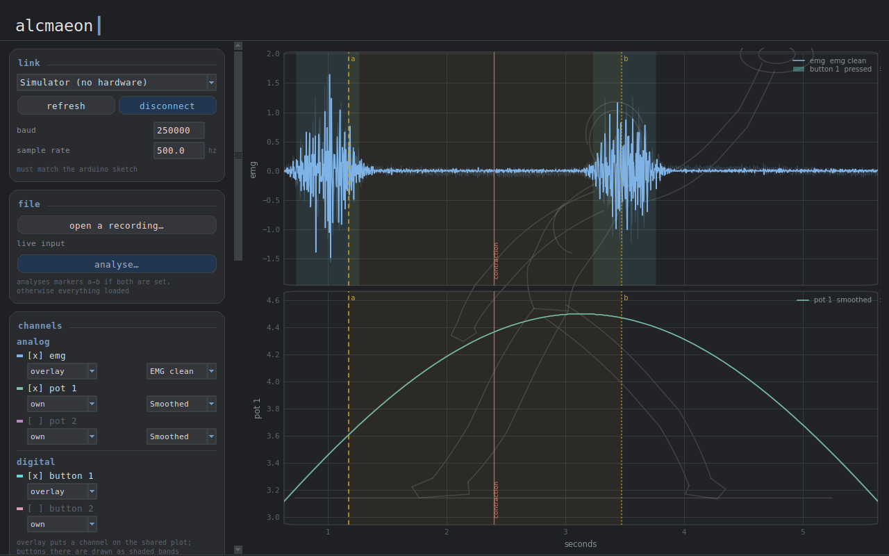

# Alcmaeon Lite

A desktop recorder for EMG and ECG breakout boards, with room for the
potentiometers and buttons you have wired up alongside them. Live filtering,
stacked or overlaid graphs, timestamped CSV recording, and an analysis pass
over any span you select.

Named after Alcmaeon of Croton, who argued the brain — not the heart — is the
seat of sensation.



---

## Features

- **Any simple analog biopotential board** — MyoWare, MyoWare 2.0, Grove EMG,
  AD8232 ECG, Olimex shields: anything with a plain analog output.
- **Mixed signals in one view** — biopotentials, potentiometers and buttons on
  a shared time base. Button presses draw as shaded bands over the signal, so
  it is obvious whether a burst lines up with a press.
- **Live filtering** — band-pass, mains notch, envelope, RMS and more, applied
  per channel as samples arrive. Cutoffs are editable while running.
- **Recording with timestamps** — streams straight to CSV with no length
  limit, keeping both raw and filtered values, plus wall-clock and device
  time. Label moments as they happen; mark a span and export just that.
- **Review and analysis** — reopen a saved session, scrub through it, and
  measure any span: RMS, mean absolute value, median and mean frequency,
  contraction detection, button statistics.
- **Runs without hardware** — a built-in simulator generates EMG bursts,
  potentiometer sweeps and button presses, so the whole app can be explored
  before anything is wired.
- **No command line** — double-click launchers for Windows, macOS and Linux
  handle dependency setup on first run.

## Requirements

Python 3.9 or newer, plus numpy, matplotlib and pyserial — the launcher
installs those three into a local virtual environment on first run.

An Arduino (Uno, Nano, Pro Mini or similar) flashed with the included sketch,
and an analog EMG/ECG board. Optional: potentiometers and buttons.

## Getting started

Download or clone this repository, then:

| System | Run |
|---|---|
| Windows | `Alcmaeon Lite.bat` |
| macOS | `Alcmaeon Lite.command` (right-click → Open the first time) |
| Linux | `alcmaeon-lite.sh` |

First launch shows a setup window while it installs dependencies into a
`.venv` folder inside the project — nothing is installed system-wide. Later
launches open straight into the app.

Select **Simulator (no hardware)** in the port list and press **connect** to
try everything without a board attached.

<details>
<summary>Running it manually instead</summary>

```bash
pip install -r requirements.txt
python run_alcmaeon.py
```
</details>

<details>
<summary>Windows and macOS security warnings</summary>

Unsigned downloads are flagged by both systems. On Windows, right-click the
downloaded `.zip` → **Properties** → tick **Unblock** before extracting, or
click **More info → Run anyway** on the SmartScreen prompt. On macOS,
right-click the `.command` file → **Open** → **Open**; plain double-clicking
will keep refusing.
</details>

<details>
<summary>macOS: "python3 requires the command line developer tools"</summary>

macOS ships `/usr/bin/python3` as a stub, and Apple's tools installer often
fails with "not available on the Software Update server". Cancel it and
install Python from [python.org](https://www.python.org/downloads/macos/)
instead — that build also bundles Tcl/Tk, which draws the window.
</details>

<details>
<summary>Linux: missing tkinter or venv</summary>

Most distributions ship Python without them:

```bash
sudo apt install python3-tk python3-venv     # Debian/Ubuntu
sudo dnf install python3-tkinter             # Fedora
```
</details>

## Hardware

Flash `arduino/alcmaeon_daq/alcmaeon_daq.ino`, then wire:

| Pin | Signal |
|-----|--------|
| A0  | EMG/ECG board signal output |
| A1  | Potentiometer 1 wiper (ends to 5 V and GND) |
| A2  | Potentiometer 2 wiper |
| D2  | Button 1 to GND (internal pull-up) |
| D3  | Button 2 to GND |

Power the biopotential board from the same 5 V and GND as the Arduino; the
shared ground is what makes the reading stable. Close the Arduino Serial
Monitor before connecting — it holds the port open.

The sketch streams CSV at 250000 baud, 500 Hz across all channels:

```
<micros>,<a0>,<a1>,<a2>,<d0>,<d1>
```

## Filters

Selectable per channel, applied in real time:

| Preset | Effect |
|---|---|
| Raw | No processing |
| DC block | Removes electrode drift only |
| Low-pass / High-pass / Band-pass | Second-order sections |
| Notch | Removes mains hum at 50 or 60 Hz |
| EMG clean | Band-pass plus notch at mains and its second harmonic |
| Envelope | EMG clean → rectify → smooth: the activation curve |
| RMS | EMG clean → sliding-window RMS |
| Smoothed | Moving average, suited to potentiometers |

Implemented as streaming one-sample-at-a-time stages, so displayed values and
recorded values are identical. No SciPy dependency.

## Rendering

Plots are drawn by caching everything static — axes, ticks, legends, backdrop —
as a bitmap and redrawing only the traces each frame, roughly ten times faster
than a conventional redraw and largely independent of channel count.

Two consequences: the x-axis reads "seconds ago" with data sliding through a
fixed window (holding the axis still is what makes the cache reusable), and the
y range tracks a slow quantised envelope rather than the current window, so it
changes rarely. Markers, events and recordings all still use absolute time.

A clock in the top-right corner of the plot shows the real time at the leading
edge and elapsed seconds, since the axis itself never moves. Recorded
timestamps come from the samples rather than the display and are unaffected by
any of this.

Traces are thinned with min/max bucketing anchored to absolute time rather
than by keeping every Nth sample, so peaks are never dropped and do not
flicker as the window slides.

Scroll the wheel over a plot to change that plot's amplitude range; it then
holds until you double-click to return it to auto-scaling.

`FAST_PLOT = False` in `config.py` restores the conventional renderer.

## Analysis

**analyse…** measures markers a→b if both are set, otherwise everything
loaded:

- RMS, mean absolute value, peak-to-peak, min/max, mean/standard deviation
- Median and mean frequency — median frequency falls as a muscle fatigues,
  usually before amplitude changes
- Zero-crossing count and rate
- Contraction detection: each burst with start, end, duration and RMS
- Per-button press count, total on-time, mean press length, duty cycle

Reports export as text. The same functions work headlessly for batch work:

```python
from alcmaeon import loader, analysis

rec = loader.load_recording("session.csv")
report = analysis.analyse(rec.t, rec.data, rec.sample_rate)
print(analysis.format_report(report))
```

Recordings name their own channels, so a file from a different setup opens
without reconfiguration: the app asks, then rebuilds its channel list, plots
and analysis around the file, and restores the original on return to live
input. Live capture still requires `config.py` to match the sketch, since a
stream carries no header describing itself.

## Data format

Recordings are plain CSV with a commented metadata header:

```
iso_time, t_seconds, device_seconds, <ch>_raw, <ch>_filtered, …, <button>…, event
```

`iso_time` is host wall-clock; `device_seconds` comes from the Arduino's own
`micros()` and is the one to trust for sample spacing.

## Setting up channels

**Channels → edit channels…** adds, renames and removes inputs from inside the
app; entries correspond to the pins in the sketch, in order. The layout is
saved to `channels.json` and restored on launch. If the board reports a
different channel count on connect, the app offers to match it in one click.

## Configuration

`alcmaeon/config.py` holds the defaults: sample rate, ADC scaling, buffer
length, filter and plotting settings. Channels are normally set up in the app
rather than here.

For an ESP32, set `ADC_MAX_COUNTS = 4095` and `ADC_VREF_VOLTS = 3.3`. For ECG
rather than EMG, use a `Band-pass` preset with cutoffs around 0.5–40 Hz.

New filters go in `alcmaeon/filters.py`: write a class with `process(x)` and
`reset()`, add its name to `PRESETS`, add a branch to `build_chain()`. It then
appears in every channel dropdown.

Colours, fonts and the rounded widgets live in `alcmaeon/theme.py`. The
backdrop drawings are procedural — no image files — in `alcmaeon/artwork.py`;
new pieces are lists of polylines in a 0..1 box added to `PIECES`.

## Project layout

```
run_alcmaeon.py              entry point
bootstrap.py                 first-run dependency setup, then launches
alcmaeon/config.py           channels, pins, rates, defaults
alcmaeon/filters.py          streaming filters and presets
alcmaeon/acquisition.py      serial reader thread and simulator
alcmaeon/buffers.py          ring buffer for scroll-back
alcmaeon/recorder.py         CSV writing
alcmaeon/loader.py           reading recordings back in
alcmaeon/analysis.py         amplitude, frequency and contraction measures
alcmaeon/artwork.py          procedural line-art backdrops
alcmaeon/theme.py            palette, rounded widgets, plot styling
alcmaeon/app.py              main window and the blitting renderer
arduino/alcmaeon_daq/        firmware
packaging/                   PyInstaller spec and icon
```

## Standalone builds

`Build standalone app.bat` / `.command` produces a single executable that runs
without Python installed, via PyInstaller. GitHub Actions builds all three
platforms on every push; tagged commits attach the binaries to a release.

## Notes

- Filters are causal and run in real time, so a filter change applies going
  forward; data already recorded keeps the values it was recorded with.
- At 500 Hz across several channels the AVR ADC needs its faster prescaler,
  enabled by default in the sketch.
- 115200 baud tops out around 250 Hz with five channels, which is why the
  default is 250000.
- Skin preparation affects EMG quality more than any filter setting.

## License

MIT — see [LICENSE](LICENSE).
